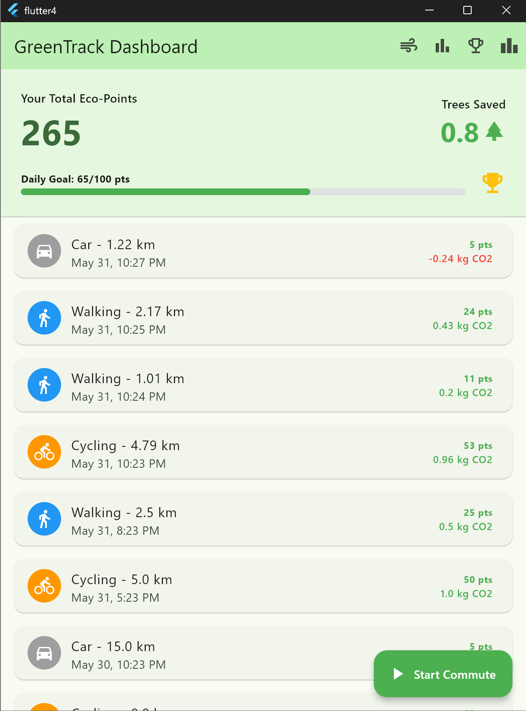
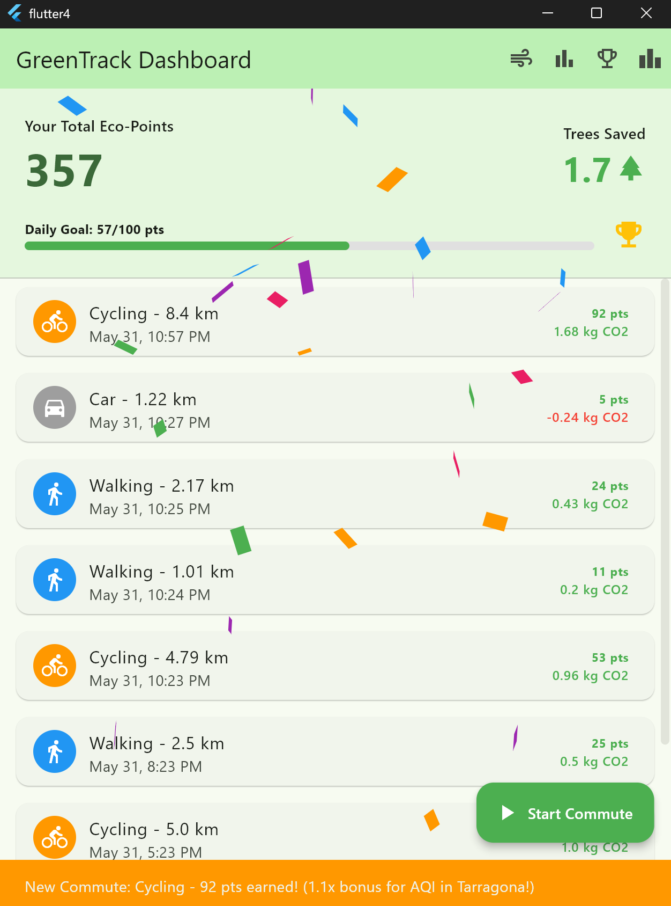
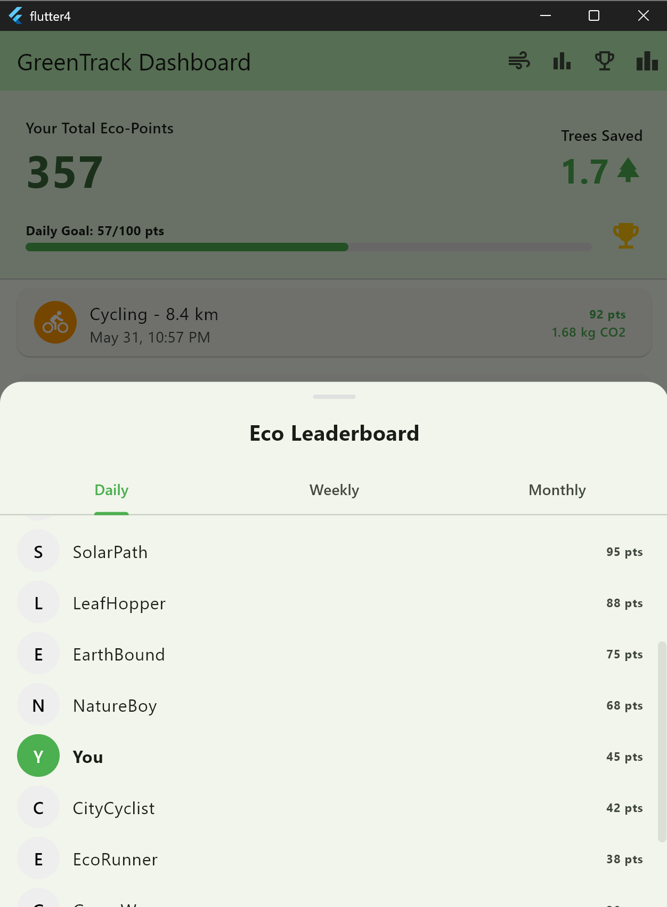
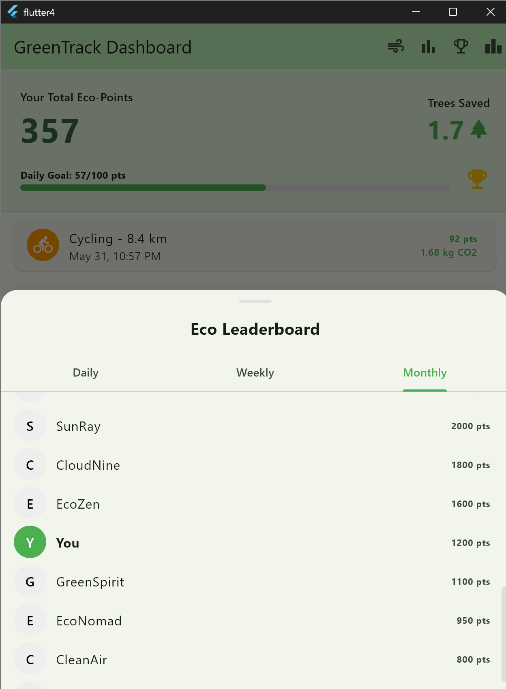
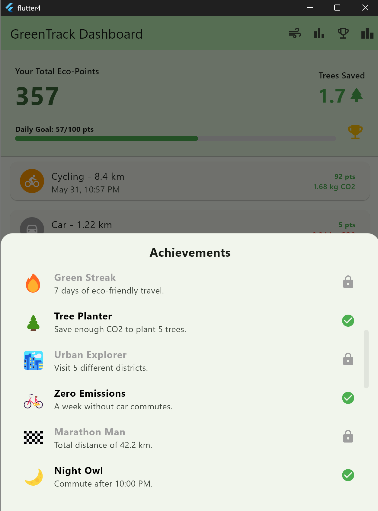
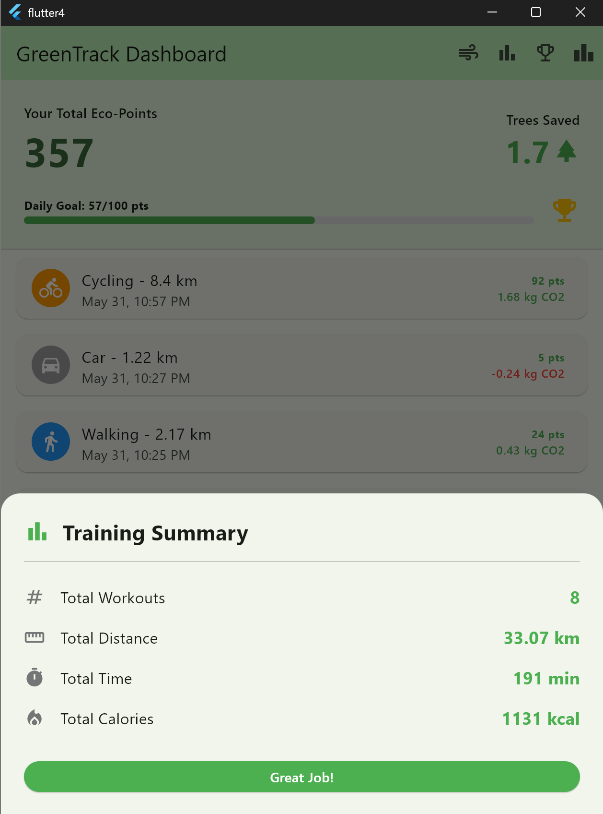
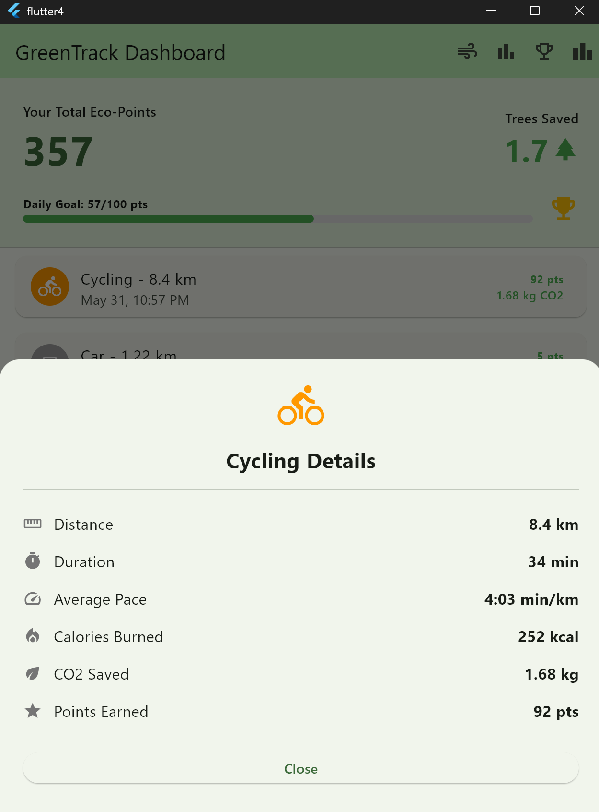
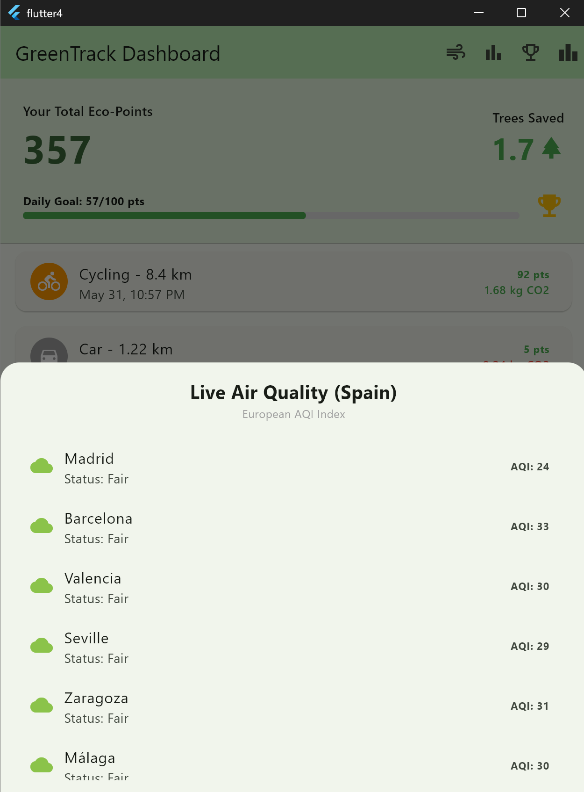

# GreenTrack: Transforming Every Step into Environmental Impact 🌿

## Description

**GreenTrack** is a next-generation mobile platform that bridges the gap between urban mobility and environmental health. While traditional fitness apps focus solely on calories, GreenTrack focuses on the **planet**. 

Our application gamifies the daily commute by turning sustainable choices—like walking and cycling—into a competitive and rewarding experience. By integrating live environmental data, we've created a unique ecosystem where the user's effort is measured not just in kilometers, but in **CO2 offset and real-world impact**.

### The "Eco-Hero" Philosophy
The core innovation of GreenTrack is our **Dynamic Reward System**. We believe that choosing to cycle or walk in a city with poor air quality is a heroic act. Therefore, the app automatically scales your rewards: the more challenging the environment (higher AQI), the higher the point multiplier (up to 2.5x). You aren't just commuting; you're actively fighting the smog where it's needed most.

## Screenshots and Navigation

  
  
  
  

  
  
  
  

## Demo Video

*Click the image above to watch the short demo of the GreenTrack experience.*

## Functional Features

* **🌍 Live AQI Multipliers:** Real-time integration with the **Open-Meteo API** for 50 Spanish cities. If you cycle in a "Red Zone" (high pollution), your points are doubled to reward your commitment to zero-emission travel.
* **🌳 Trees Saved Metric:** We translate abstract CO2 data into something tangible. For every 2kg of CO2 you save (by avoiding a car trip), you earn one "Tree Saved" unit on your dashboard.
* **🏆 Competitive Leaderboards:** Stay motivated with Daily, Weekly, and Monthly rankings. Compete with 50+ users to see who is the true "Eco-King".
* **🎖️ Achievement Odyssey:** A collection of 24+ unlockable badges, from "Early Bird" for morning commuters to "CO2 Hero" for massive carbon offsets.
* **📊 Comprehensive Training Summary:** A dedicated section that aggregates your walking and cycling data, calculating total calories burned, average pace, and total distance.

## Technical Features

* **Architecture:** Robust **Stateful Management** for real-time dashboard updates and responsive UI.
* **UI Framework:** Built with **Flutter & Material Design 3**, featuring custom-themed components, smooth transitions, and a clean, nature-inspired aesthetic.
* **Persistence Layer:** Implemented using **SharedPreferences** with custom JSON serialization. Your trip history and achievements are stored locally and persist through app restarts.
* **API Logic:** Custom service layer for fetching and parsing European Air Quality data, featuring error handling and fail-safe mock data fallbacks.
* **Dynamic Feedback:** Integrated **Confetti animations** to trigger "Dopamine Hits" upon reaching the 100-point daily goal.

## Sustainability Metrics

GreenTrack uses industry-standard approximations to calculate your impact:
- **Walking/Cycling:** +0.2kg CO2 saved per km.
- **Car Driving:** -0.2kg CO2 impact per km.
- **Tree Offset:** 1 Tree unit = 2kg of CO2 reduction (representing the daily absorption capacity of a mature tree).

## Global Impact (SDG Alignment)

GreenTrack actively contributes to the **United Nations Sustainable Development Goals**:
- **Goal 11:** Sustainable Cities and Communities.
- **Goal 13:** Climate Action.

## Participants

**MAD Developers:**

* **[Igor Kondrat]** (i.kondrat@alumnos.upm.es)
* **[Silvana Dimitrova]** (silvana.dimitrova@alumnos.upm.es)

**Workload distribution:** (50%/50%)
